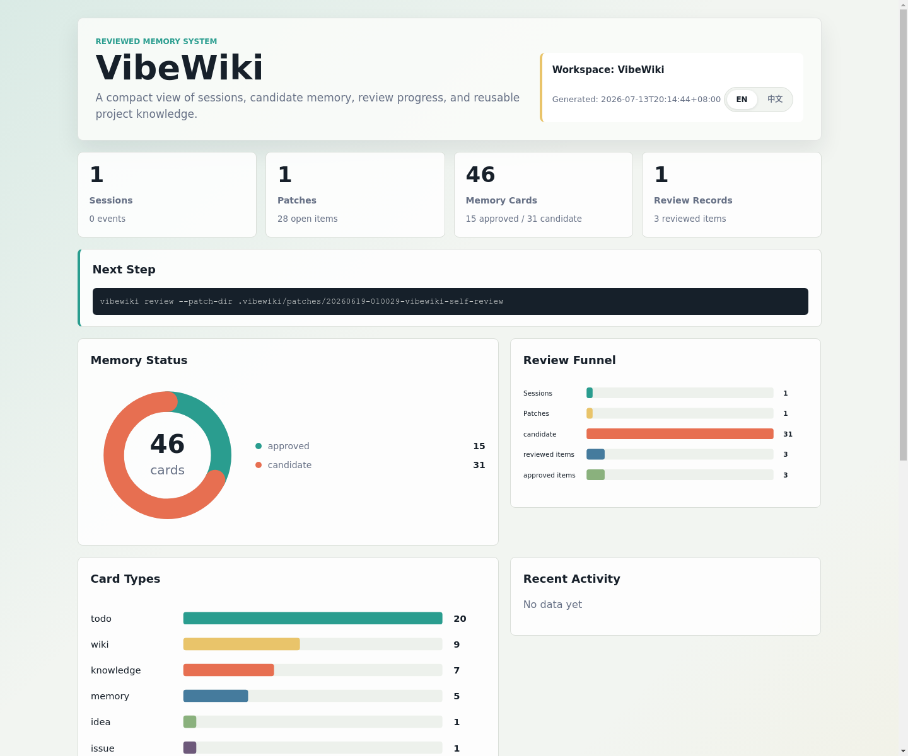

# VibeWiki

The reviewed memory layer for AI coding agents.

> Stop solving the same bug twice.

Use Codex, Claude Code, Cline, Aider, OpenHands, Cursor, or Copilot to code.
Use Repomix, Gitingest, DeepWiki-style tools, or repo maps to understand a
repository. Use VibeWiki to remember what actually worked.

AI coding is fast, but the useful knowledge often disappears into chat logs,
temporary commands, diffs, and test output. VibeWiki turns those traces into
reviewable findings, Wiki patches, composable skilllets, prompt patterns,
workflows, and agent rules, then feeds them back into future development.

In plain words: VibeWiki is a project and personal memory compiler for AI
coding. It can bootstrap a new project Wiki by quickly understanding the
repository, then grow that Wiki from real vibe-coding conversations.

## Why VibeWiki?

Most AI coding tools are great at doing the next task. VibeWiki focuses on what
happens after the task succeeds:

```text
conversation + commands + diff + tests + notes
-> candidate memory
-> human review
-> project/personal Wiki + skills + workflows + agent rules
```

VibeWiki does not replace the tools around it. It is designed to build on them:

| Tool family | Best at | VibeWiki adds |
| --- | --- | --- |
| Repomix / Gitingest | packing repo context for LLMs | reviewed memory after coding |
| DeepWiki / RepoAgent / CodeWiki-style tools | generating repo understanding | evidence-backed updates from real sessions |
| Codex / Claude Code / Cline / Aider / OpenHands | doing coding work | preserving what worked and why |
| Anthropic Skills / AGENTS.md / Cursor rules | executable agent instructions | generating and evolving instructions from evidence |
| Obsidian / GitHub Wiki / Markdown docs | storing notes | compiling notes from AI collaboration |

See [`docs/ecosystem.md`](docs/ecosystem.md) for the fuller ecosystem stance.

## Three-Minute Demo

```bash
git clone https://github.com/<your-org>/VibeWiki.git
cd VibeWiki
python3 -m pip install -e .

vibewiki setup
vibewiki import-markdown examples/venus/sample_session.md --session-name demo
vibewiki distill
vibewiki doctor
vibewiki dashboard
vibewiki review-board
```

Then open `.vibewiki/dashboard.html` for the memory dashboard, or the generated
review board under `.vibewiki/patches/<session>/`.

## Interface Preview

`vibewiki dashboard` generates a static, dependency-free HTML dashboard. It
defaults to English for open-source demos and includes an `EN / 中文` switch in
the page.



For the full walkthrough, see [`docs/demo.md`](docs/demo.md).

`vibewiki setup` is the recommended first-run experience. It asks whether you
want a project Wiki or personal Wiki, where to store it, and whether to generate
a first project brief with the built-in local understanding pass.

The first version is intentionally local and conservative:

- `vibewiki init` creates the project memory folders.
- `vibewiki setup` runs the first-time project/personal Wiki setup wizard.
- `vibewiki doctor` inspects workspace state and suggests the next command.
- `vibewiki capture` records one coding session, including git diff and notes.
- `vibewiki import-markdown` imports an exported Codex, Claude, or Cursor session.
- `vibewiki import-url` imports a shared conversation URL, including ChatGPT share links.
- `vibewiki distill` creates candidate memory patches.
- `vibewiki review-plan` groups raw candidates into a smaller review queue.
- `vibewiki review-board` renders a local HTML review board for candidate patches.
- `vibewiki review-ui` serves a clickable local review UI for SSH/remote workflows.
- `vibewiki dashboard` renders a local HTML dashboard with memory and review charts.
- `vibewiki validate-skill` checks Skill Patch quality gates.
- `vibewiki review` records human approval.
- `vibewiki review-item` records item-level approve/reject/defer/downgrade/merge/edit decisions.
- `vibewiki merge` appends approved patches to docs, skills, and agent rules.
- `vibewiki events` shows the project memory ledger for team audit and reuse.
- `vibewiki ask` answers human questions from approved and candidate memory.
- `vibewiki context` emits compact YAML/JSON context packs for AI agents.
- `vibewiki search` inspects the retrieved evidence directly.
- `vibewiki understand` generates a quick local project-understanding brief.

VibeWiki does not directly mutate your main knowledge base before review. Facts
start as candidates, uncertain claims stay marked, and missing context becomes
questions for a human.

VibeWiki can run in bilingual mode. The default project configuration keeps the
user's working language while adding brief bilingual structure for Wiki pages
and review surfaces:

```yaml
language:
  mode: bilingual
  primary: zh
  secondary: en
```

## What It Does

VibeWiki has two complementary jobs:

- bootstrap memory: scan a project, identify the first files to read, and write
  a baseline project brief before any deep work starts
- grow memory: capture vibe-coding conversations, distill what was learned, and
  merge reviewed knowledge and skills back into the Wiki

VibeWiki treats a finished AI conversation as evidence, not as a skill by
itself. One conversation may contain several useful ideas; several conversations
may improve the same idea over time.

It creates reviewable artifacts:

- a Wiki note that explains what changed and why
- findings: knowledge, issues, todos, ideas, research notes, and directions
- skilllets: small, composable capability units
- prompt patterns: reusable prompts and agent task package shapes
- workflows: larger procedures composed from skilllets
- a compatibility Skill Patch with commands, probes, evidence, and failure modes
- Agent Rules for future coding agents
- clarification questions for anything that is still uncertain

The important bit: it keeps raw evidence, asks for human approval, and only then
merges knowledge into the project.

When approved units are merged, VibeWiki updates `.vibewiki/skill_registry.yaml`.
Later sessions use that registry to update existing skilllets by exact slug or
alias instead of creating duplicates. Lower-confidence keyword overlap becomes a
merge suggestion for review rather than an automatic merge.

## Why This Exists

AI coding agents are powerful, but they forget project-specific lessons:

- the exact command that reproduced a simulator bug
- the row/lane/config setting that made a benchmark valid
- the workaround that should not be repeated later
- the test output that proved a fix
- the reason a parameter changed

VibeWiki gives those lessons a home.

## Install From Source

```bash
cd /path/to/VibeWiki
python3 -m pip install -e .
```

You can also run it directly while developing:

```bash
python3 -m vibewiki.cli --help
```

## Quick Start

In any project you want to give memory:

```bash
vibewiki setup
vibewiki capture --goal "Fix simulator mismatch" \
  --outcome "Aligned VEMU output with the reference trace" \
  --command "make run-vemu" \
  --command "python3 compare_outputs.py" \
  --tests "compare_outputs.py passed"
vibewiki distill
vibewiki dashboard
vibewiki review-board
vibewiki validate-skill
vibewiki review --approve
vibewiki merge
```

Or import a saved AI session:

```bash
vibewiki import-markdown ./codex-session.md
vibewiki distill
vibewiki dashboard
vibewiki review-board
vibewiki validate-skill
vibewiki review --approve
vibewiki merge
```

Or import a shared ChatGPT conversation link:

```bash
vibewiki import-url "https://chatgpt.com/share/..."
vibewiki distill
vibewiki dashboard
vibewiki review-board
vibewiki review --approve
vibewiki merge
```

`import-url` keeps both a readable `raw_session.md` and the original
`raw_source.html`. For ChatGPT share pages, it can extract conversations from
the page data stream instead of only reading the visible login/sidebar shell.
If a page is private, expired, or rendered in a new unsupported format, the raw
HTML is still preserved so the parser can be improved later.

This creates:

```text
.vibewiki/
  config.yaml
  skill_registry.yaml
  events.jsonl
  sessions/
  patches/
  reviews/
docs/wiki/
  knowledge.md
  known_issues.md
  todos.md
  ideas.md
  research_notes.md
  directions.md
skills/
  skilllets/
  prompt_patterns/
  workflows/
AGENTS.md
```

Use strict validation when you want warnings to block promotion:

```bash
vibewiki validate-skill --strict
```

For onboarding yourself or a new AI agent to an unfamiliar repository, ask
VibeWiki for a local project brief:

```bash
vibewiki understand --output docs/wiki/project_brief.md
vibewiki understand --format json
```

The brief is deliberately dependency-free. It scans local text files, manifests,
entrypoints, docs, tests, scripts, Python symbols, and internal imports, then
suggests the first files to read. This is the built-in lightweight path; heavier
repo-understanding systems such as RepoGraph-style repository maps or
CodeWiki-style generated architecture docs can be layered on later.

For a personal knowledge base, point `--project` at a personal VibeWiki folder
and import conversations, notes, or reusable workflows there. Project Wikis hold
local facts and commands; personal Wikis hold cross-project habits, prompts,
research notes, and skills that should follow you.

For scripted setup, use:

```bash
vibewiki setup --scope project --project-path /path/to/repo --understand
vibewiki setup --scope personal --wiki-path ~/VibeWikiPersonal --no-understand
```

`import-markdown` and `import-url` preserve the full original evidence, then
create a normalized `session.md` with detected title, outcome signals, commands,
verification hints, and benchmark hints. Treat the normalized fields as a review
draft, not as final truth.

`review-board` writes a static `review_board.html` beside the selected patch. It
groups findings, candidate skilllets, prompt patterns, workflows, open
questions, merge suggestions, and approve/merge commands into one page so review
does not require opening a directory full of Markdown files one by one.

For remote development over SSH, `review-ui` is usually easier than opening the
static HTML. It starts a local-only server that VSCode Remote-SSH can forward to
your browser:

```bash
vibewiki review-ui --patch-dir .vibewiki/patches/<session> --port 8765
```

Open `http://127.0.0.1:8765/` after forwarding the port. Before rendering, the
UI writes a machine-readable `.vibewiki/patches/<session>/review_plan.json`.
That plan keeps every raw candidate, but defaults the page to a smaller review
batch and hides lower-priority or suggested-discard items behind switches.

The page keeps review deliberately small: preview a candidate, submit it,
discard it, edit the candidate Markdown directly, or write a short revision
instruction and let the configured LLM generate a revised candidate. The LLM
only rewrites the draft; the human still decides whether to submit it.
Candidate Markdown is previewed as rendered Markdown by default, and the review
surface can switch between Chinese and English labels while keeping the
underlying Markdown memory in English. For reviewers who prefer another
language, each card can also generate a cached Markdown translation preview.
That translation is display-only and stored under `.vibewiki/cache/`; it never
rewrites the source candidate. Translation is token-conscious by default:
VibeWiki prefers a free LibreTranslate-compatible API or local Argos Translate,
and only uses an LLM when `VIBEWIKI_TRANSLATION_PROVIDER=llm` is set explicitly.

You can inspect or regenerate the triage plan from the terminal:

```bash
vibewiki review-plan --patch-dir .vibewiki/patches/<session>
```

For a visual project-memory overview, generate the dashboard:

```bash
vibewiki dashboard
vibewiki dashboard --output docs/vibewiki_dashboard.html
```

The dashboard is a static, dependency-free HTML page with memory-card status,
review backlog, card type distribution, recent activity, and the next suggested
command. It defaults to English and has an in-page Chinese/English switch. It
is meant for humans, demos, and team standups; `context` remains the
token-conscious interface for AI agents.

For fine-grained review, use the per-item commands shown on each card:

```bash
vibewiki review-item --patch-dir .vibewiki/patches/<session> \
  --item findings/todo__example.md --decision approve
vibewiki review-item --patch-dir .vibewiki/patches/<session> \
  --item skilllets/example.md --decision downgrade --target knowledge
vibewiki review-item --patch-dir .vibewiki/patches/<session> \
  --item skilllets/new-name.md --decision merge --target existing-skilllet
vibewiki review-item --patch-dir .vibewiki/patches/<session> \
  --item findings/idea__example.md --decision edit \
  --title "Reviewed title" --summary "Reviewed summary"
```

Item decisions are stored as JSON under `.vibewiki/reviews/`. During `merge`,
rejected or deferred items are skipped, downgraded items are written to the Wiki,
merged reusable units append to the requested existing slug, and edited items
carry the reviewed title or summary.

VibeWiki also records a tiny project memory ledger at `.vibewiki/events.jsonl`
when commands run through the CLI. It is intentionally simple: append-only JSONL
events for capture/import, distill, review, merge, search, ask, and context
generation. This gives a team a lightweight audit trail without turning
VibeWiki into a heavy project-management system:

```bash
vibewiki events --limit 20 --verbose
```

VibeWiki also dogfoods this workflow on its own design conversations. See
[`docs/improvement_backlog.md`](docs/improvement_backlog.md) and
[`docs/wiki/`](docs/wiki/) for the current reviewed product memory.

## Reuse Memory

VibeWiki has two reuse entrances:

```bash
vibewiki ask "CloudRIC 能不能说比传统基站省电？"
vibewiki cards "远程 MATLAB 仿真"
vibewiki context --for "debug VCMXMUL mismatch"
```

`ask` is for humans. It first searches compact memory cards that summarize
who did what, how, with what result, confidence, recorder, and source. If an
OpenAI-compatible LLM API is configured, VibeWiki asks the model to answer from
those cards instead of long raw snippets. If no card matches, it falls back to
local Markdown retrieval. Use `--verbose` or `search` when you want to inspect
the underlying evidence.

`cards` shows the compact memory layer directly:

```bash
vibewiki cards "怎么运行 MATLAB 仿真" --json
```

`context` is for AI agents. It returns a compact, machine-readable context pack
so a coding agent can start with relevant facts, skills, warnings, and sources
instead of making the user rewrite a long prompt:

```bash
vibewiki context --for "run VEMU F5" --format json --max-items 5 --max-chars 500
```

`search` shows the raw ranked evidence:

```bash
vibewiki search "VEMU F5 TARGET_DAG"
```

Search covers both reviewed memory and unreviewed patches by default. Results
are marked as `approved` or `candidate`.

Retrieval is local-first. VibeWiki always has a keyword/BM25 fallback. If an
OpenAI-compatible embedding API is configured, it adds semantic retrieval and
caches vectors under `.vibewiki/cache/embeddings/`, which is ignored by Git:

```bash
export VIBEWIKI_EMBEDDING_BASE_URL="https://api.openai.com/v1"
export VIBEWIKI_EMBEDDING_API_KEY="..."
export VIBEWIKI_EMBEDDING_MODEL="text-embedding-3-small"
```

LLM answers use OpenAI-compatible chat completions:

```bash
export VIBEWIKI_LLM_BASE_URL="https://api.openai.com/v1"
export VIBEWIKI_LLM_API_KEY="..."
export VIBEWIKI_LLM_MODEL="gpt-4.1-mini"
```

The same environment variable shape can point at OpenRouter, DeepSeek, local
OpenAI-compatible servers, or other compatible providers.

MiniMax Token Plan can use its OpenAI-compatible endpoint directly:

```bash
export VIBEWIKI_LLM_BASE_URL="https://api.minimaxi.com/v1"
export VIBEWIKI_LLM_API_KEY="..."
export VIBEWIKI_LLM_MODEL="MiniMax-M1"
```

VibeWiki also recognizes the provider-style variables from MiniMax/OpenAI SDK
examples, so this works too:

```bash
export OPENAI_BASE_URL="https://api.minimaxi.com/v1"
export OPENAI_API_KEY="..."
export OPENAI_MODEL="MiniMax-M1"
```

Or, for the shortest MiniMax setup:

```bash
export MINIMAX_API_KEY="..."
# optional override
export MINIMAX_MODEL="MiniMax-M1"
```

Do not commit API keys. If you keep them in a local `.env`, source that file in
your shell before running VibeWiki.

Markdown preview translation is configured separately so review does not burn
LLM tokens by accident. For a free/self-hosted LibreTranslate-compatible server:

```bash
export VIBEWIKI_TRANSLATION_PROVIDER="libretranslate"
export VIBEWIKI_TRANSLATION_BASE_URL="http://127.0.0.1:5000"
# optional, only if your server requires it
export VIBEWIKI_TRANSLATION_API_KEY="..."
```

If `argostranslate` and the needed language packages are installed locally, use:

```bash
export VIBEWIKI_TRANSLATION_PROVIDER="argos"
```

To opt into LLM translation anyway:

```bash
export VIBEWIKI_TRANSLATION_PROVIDER="llm"
```

## Project Philosophy

1. Trust beats automation.
2. Record the final verified path, not every failed attempt.
3. Keep knowledge out of the main Wiki until a human approves it.
4. Extract small skilllets instead of one oversized session-specific skill.
5. Keep non-procedural memory as findings rather than forcing it into skills.
6. Let repeated sessions evolve the same skilllet by appending evidence.
7. Validate Skill contracts before they become project guidance.
8. Treat agent-facing rules as a first-class output.
9. Start local, then add GitHub PR workflows and retrieval.

## Roadmap

- `v0.1`: local CLI and reviewable memory patch workflow
- `v0.2`: bootstrap and personal memory workflows
- `v0.3`: GitHub PR comment workflow
- `v0.4`: Skilllet versioning, deprecation, and cross-session evolution
- `v0.5`: Venus/VEMU/gem5/RTL case study
- `v0.6`: local Markdown retrieval with citations and LLM-Wiki-style search/read
- `v1.0`: CLI, GitHub Action, docs, examples, and demo video

See [`docs/roadmap.md`](docs/roadmap.md) for the detailed roadmap.

## LLM-Wiki Compatibility

VibeWiki is designed to complement LLM-Wiki-style systems. VibeWiki handles the
trusted ingestion path from AI coding sessions to reviewed project memory; an
LLM-Wiki-style layer can later expose that approved memory through search, read,
link traversal, `llms-full.txt`, or prompt-cache workflows.

See [`docs/research_llm_wiki.md`](docs/research_llm_wiki.md).

## Ctx2Skill-Inspired Direction

VibeWiki can also borrow from Ctx2Skill-style skill evolution. The practical
version is simple: every reusable skilllet should include invocation conditions,
contraindications, probes, evidence, and environment requirements. Later,
VibeWiki can replay skilllet updates against older sessions before promoting
them.

See [`docs/research_ctx2skill.md`](docs/research_ctx2skill.md).

## ECC-Inspired Direction

ECC shows a mature cross-harness agent layer: skills, hooks, agents, rules,
MCPs, installers, and continuous learning. VibeWiki should not become a giant
harness bundle. The useful idea to borrow is smaller: reviewed atomic
`instincts` with scope, confidence, evidence, and a promotion path into
skilllets, workflows, or agent rules.

This keeps VibeWiki positioned as an upstream trusted memory compiler that can
feed systems such as ECC, Codex skills, Claude skills, Cursor rules, and
LLM-Wiki-style retrieval layers.

See [`docs/research_ecc.md`](docs/research_ecc.md).

## Killer Demo

Venus is the first serious case study: use VibeWiki to preserve hard-won
knowledge from VEMU simulation, gem5 performance runs, RTL alignment, MATLAB
gold comparisons, compiler backend debugging, and LDPC benchmark validation.

See the first real example in
[`examples/venus/real_sessions/cmxmul_ofdm`](examples/venus/real_sessions/cmxmul_ofdm/README.md).
