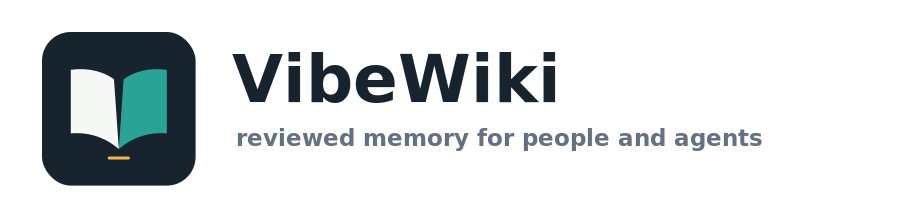
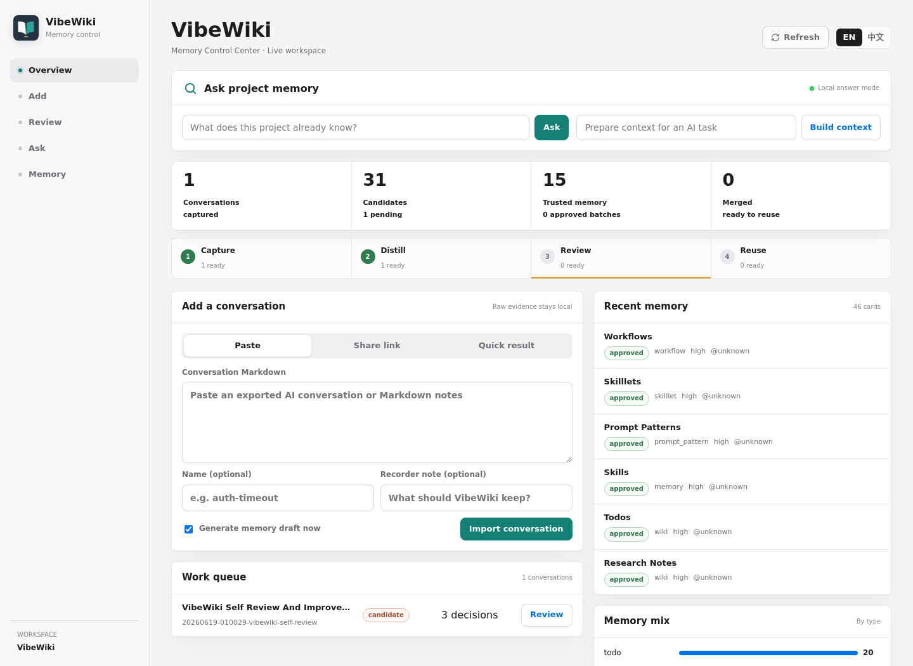
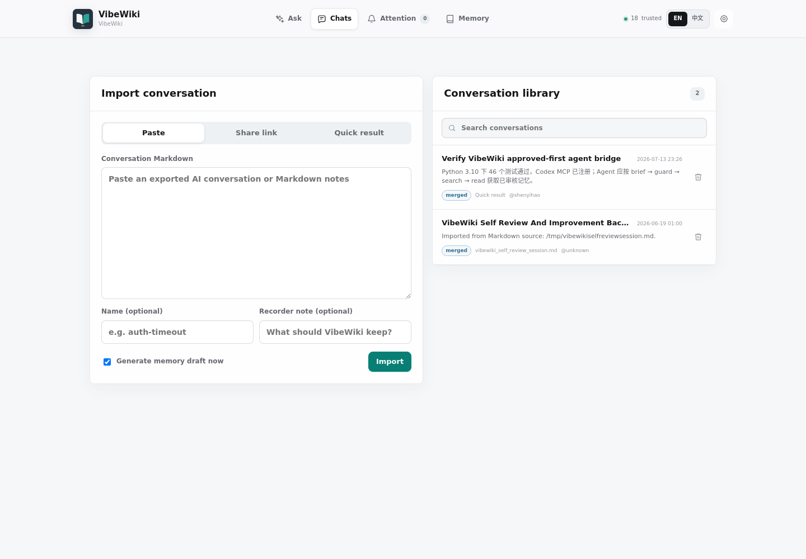

<p align="center">
  
</p>

<p align="center">
  <a href="https://github.com/HorryShenYH/VibeWiki/stargazers"></a>
  <a href="https://github.com/HorryShenYH/VibeWiki/actions/workflows/tests.yml"></a>
  
  
  
  
</p>

# VibeWiki

<p align="center">
  <strong>Stop paying the AI amnesia tax.</strong>
</p>

<p align="center">
  Your AI forgot. Your project should not.<br>
  VibeWiki turns coding conversations into source-linked memory that you, your team,
  and every future agent can reuse.
</p>

<p align="center">
  <strong>One command. One control center. No archaeology through old chats.</strong>
</p>



<p align="center">
  <strong>If AI tools should remember what a team has already learned, star
  VibeWiki and help make that memory portable.</strong>
</p>

## Start In One Command

```bash
git clone https://github.com/HorryShenYH/VibeWiki.git
cd VibeWiki
python3 -m pip install -e .
vibewiki ui
```

Open `http://127.0.0.1:8765/`. Ask what the project already knows, add a past
conversation, handle only the exceptions that need attention, or inspect
project memory. Low-risk knowledge is checked and added automatically. The same
quiet workspace can also build compact context packs for AI agents.

For VS Code Remote SSH, forward port `8765` and open the same address locally.

## Give Any AI The Project Memory

```bash
vibewiki agent install
```

VibeWiki adds a small approved-memory rule block to `AGENTS.md`, writes a local
MCP descriptor, and prints the command needed to connect an AI client. Codex
users can register it directly:

```bash
vibewiki agent install --register-codex
```

After starting a new agent session, the AI can load a compact project brief,
check known risks, search reviewed memory, and read only the selected sources.
It does not need the whole Wiki pasted into every prompt, and candidate memory
stays excluded unless explicitly requested.

See [`docs/agent-integration.md`](docs/agent-integration.md) for the tool model,
trust boundary, fallback mode, and protocol smoke test.

## The Memory Loop

```text
PASTE A CONVERSATION
        ↓
DISTILL WHAT MATTERS
        ↓
ASSURE LOCALLY · REVIEW EXCEPTIONS
        ↓
ASK IT LATER · GIVE IT TO ANY AGENT
```

Every useful fix, decision, command, warning, workflow, and unfinished idea gets
a durable home without turning raw chat history into unquestioned truth.

## Automatic Without Being Opaque

VibeWiki does not make you approve every extracted sentence. A zero-token local
assurance pass checks provenance, structure, duplicates, conflicts, and review
coverage after each distillation:

- ordinary source-linked knowledge is promoted automatically
- reusable skills, conflicting memories, incomplete provenance, and suspicious
  over-distillation appear in Attention
- repeated findings collapse into one exception instead of a long review queue
- every merge writes a Proof Report with source, candidate, output hashes, and
  the decision method

The report says when semantic review was not run. It proves which memory
snapshot was processed; it does not pretend that software guaranteed every
claim. This approach borrows the strongest assurance ideas from
[Recensa](docs/research_recensa.md) without spending three model calls on every
conversation.

## Why Developers Care

| Today | With VibeWiki |
| --- | --- |
| Search through old chat tabs | Ask one project memory |
| Explain the same context to every agent | Let the agent retrieve approved memory itself |
| Let knowledge disappear when a teammate leaves | Keep reviewed memory in the repository |
| Trust opaque automatic memory | See the source, recorder, assurance status, and confidence |
| Spend tokens rediscovering old answers | Reuse what the team already paid to learn |

## Personal Memory And Project Memory

| Mode | What it remembers | Who reuses it |
| --- | --- | --- |
| Personal Wiki | your recurring solutions, preferences, prompts, research notes, and ideas | you and the AI tools you use across projects |
| Project Wiki | shared decisions, commands, known issues, workflows, and verified fixes | every developer and AI agent working in the repository |

Both modes use plain local files. You decide what becomes trusted memory, and
you can inspect where every memory came from.

## Why It Stands Out

| Common approach | What it gives you | What VibeWiki adds |
| --- | --- | --- |
| RAG over docs | retrieve existing text | evidence-backed memory from real work |
| Repo maps / generated docs | understand the current codebase | remember what happened while people changed it |
| Agent rules / skills | static instructions | reviewed skill evolution from repeated sessions |
| Chat history | raw conversation logs | compact memory cards with source, actor, and confidence |
| Personal or team wiki | manually written notes | conversation-to-knowledge capture with a review step |

See [`docs/ecosystem.md`](docs/ecosystem.md) for the fuller ecosystem stance.

## What You Get After One Session

| Output | Human value | Agent value |
| --- | --- | --- |
| Memory cards | quick answers with source, actor, and confidence | compact facts instead of long chat logs |
| Attention ledger | review only skills, conflicts, and incomplete evidence | exposes what is trusted vs still candidate |
| Wiki patches | durable project notes | stable context for future tasks |
| Skilllets and workflows | reusable team procedures | composable task instructions |
| Context packs | share just enough background | JSON/YAML input for coding agents |

`vibewiki ui` is the recommended first-run experience. It initializes missing
local memory folders automatically. Use `vibewiki setup` only when you want the
guided personal/project Wiki setup or an initial project brief.

The control center is the primary interface:

- paste a conversation or import a shared link
- browse and search every imported conversation in one library
- remove a conversation with a Wiki impact preview and recoverable Trash archive
- generate memory automatically and review only flagged exceptions
- ask questions or build context for the next AI agent

<details>
<summary>CLI commands for scripts and automation</summary>

- `vibewiki ui` opens the complete control center.

- `vibewiki agent install` connects an AI agent to approved project memory.
- `vibewiki mcp` serves brief/search/read/guard tools over local stdio MCP.
- `vibewiki init` creates the project memory folders.
- `vibewiki setup` runs the first-time project/personal Wiki setup wizard.
- `vibewiki doctor` inspects workspace state and suggests the next command.
- `vibewiki capture` records one coding session, including git diff and notes.
- `vibewiki import-markdown` imports an exported Codex, Claude, or Cursor session.
- `vibewiki import-url` imports a shared conversation URL, including ChatGPT share links.
- `vibewiki distill` creates candidate memory patches.
- `vibewiki review-plan` groups raw candidates into a smaller review queue.
- `vibewiki assure` runs local checks and prints the compact exception ledger.
- `vibewiki review-board` renders a local HTML review board for candidate patches.
- `vibewiki review-ui` serves a clickable local review UI for SSH/remote workflows.
- `vibewiki dashboard` renders a local HTML dashboard with memory and review charts.
- `vibewiki validate-skill` checks Skill Patch quality gates.
- `vibewiki review` records human approval.
- `vibewiki review-item` records item-level approve/reject/defer/downgrade/merge/edit decisions.
- `vibewiki merge` appends approved patches to docs, skills, and agent rules.
- `vibewiki events` shows the project memory ledger for team audit and reuse.
- `vibewiki ask` answers human questions from approved and candidate memory.
- `vibewiki context` emits compact YAML/JSON context packs for AI agents.
- `vibewiki guard` checks a task against approved warnings, rules, and workflows.
- `vibewiki search` inspects the retrieved evidence directly.
- `vibewiki understand` generates a quick local project-understanding brief.

</details>

VibeWiki keeps raw candidates and source evidence before promotion. In the
default `exceptions` mode, ordinary knowledge can enter the Wiki after local
assurance; skills, conflicts, incomplete provenance, and unusually large
candidate sets remain blocked for human attention.

VibeWiki can run in bilingual mode. The default project configuration keeps the
user's working language while adding brief bilingual structure for Wiki pages
and review surfaces:

```yaml
language:
  mode: bilingual
  primary: zh
  secondary: en
```

## What It Does

VibeWiki has two complementary jobs:

- bootstrap memory: scan a project, identify the first files to read, and write
  a baseline project brief before any deep work starts
- grow memory: capture vibe-coding conversations, distill what was learned, and
  merge reviewed knowledge and skills back into the Wiki

VibeWiki treats a finished AI conversation as evidence, not as a skill by
itself. One conversation may contain several useful ideas; several conversations
may improve the same idea over time.

It creates reviewable artifacts:

- a Wiki note that explains what changed and why
- findings: knowledge, issues, todos, ideas, research notes, and directions
- skilllets: small, composable capability units
- prompt patterns: reusable prompts and agent task package shapes
- workflows: larger procedures composed from skilllets
- a compatibility Skill Patch with commands, probes, evidence, and failure modes
- Agent Rules for future coding agents
- clarification questions for anything that is still uncertain

The important bit: it keeps raw evidence, separates generation from assurance,
and spends human attention only where a wrong memory could compound later.

When approved units are merged, VibeWiki updates `.vibewiki/skill_registry.yaml`.
Later sessions use that registry to update existing skilllets by exact slug or
alias instead of creating duplicates. Lower-confidence keyword overlap becomes a
merge suggestion for review rather than an automatic merge.

## Why This Exists

AI conversations are useful in the moment, but poor as long-term memory:

- one conversation may contain several unrelated lessons
- the final answer is mixed with failed attempts and stale assumptions
- teammates cannot easily discover what somebody else already learned
- a new agent starts from zero unless a developer writes another long prompt
- valuable decisions, warnings, and ideas are hard to find weeks later

VibeWiki gives those lessons a durable, searchable, and reviewable home.

## CLI Automation

The UI is the default. The CLI exposes the same memory lifecycle for scripts,
CI, and agent integrations:

```bash
vibewiki import-markdown ./codex-session.md
vibewiki distill
vibewiki review --approve
vibewiki merge

vibewiki ask "How did we solve the auth timeout?"
vibewiki context --for "update the auth client" --format json
```

`import-url` keeps both a readable `raw_session.md` and the original
`raw_source.html`. For ChatGPT share pages, it can extract conversations from
the page data stream instead of only reading the visible login/sidebar shell.
If a page is private, expired, or rendered in a new unsupported format, the raw
HTML is still preserved so the parser can be improved later.

This creates:

```text
.vibewiki/
  config.yaml
  skill_registry.yaml
  events.jsonl
  sessions/
  patches/
  reviews/
docs/wiki/
  knowledge.md
  known_issues.md
  todos.md
  ideas.md
  research_notes.md
  directions.md
skills/
  skilllets/
  prompt_patterns/
  workflows/
AGENTS.md
```

Use strict validation when you want warnings to block promotion:

```bash
vibewiki validate-skill --strict
```

For onboarding yourself or a new AI agent to an unfamiliar repository, ask
VibeWiki for a local project brief:

```bash
vibewiki understand --output docs/wiki/project_brief.md
vibewiki understand --format json
```

The brief is deliberately dependency-free. It scans local text files, manifests,
entrypoints, docs, tests, scripts, Python symbols, and internal imports, then
suggests the first files to read. This is the built-in lightweight path; heavier
repo-understanding systems such as RepoGraph-style repository maps or
CodeWiki-style generated architecture docs can be layered on later.

For a personal knowledge base, point `--project` at a personal VibeWiki folder
and import conversations, notes, or reusable workflows there. Project Wikis hold
local facts and commands; personal Wikis hold cross-project habits, prompts,
research notes, and skills that should follow you.

For scripted setup, use:

```bash
vibewiki setup --scope project --project-path /path/to/repo --understand
vibewiki setup --scope personal --wiki-path ~/VibeWikiPersonal --no-understand
```

`import-markdown` and `import-url` preserve the full original evidence, then
create a normalized `session.md` with detected title, outcome signals, commands,
verification hints, and benchmark hints. Treat the normalized fields as a review
draft, not as final truth.

The **Chats** view keeps import on the left and the complete conversation library
on the right. Conversations are recent-first, searchable by title, outcome,
source, or recorder, and show whether their memory is captured, candidate,
approved, or merged.

Removing a conversation is provenance-aware. Before deletion, VibeWiki shows how
many Wiki blocks and files will change. Raw evidence, candidate patches, and
review records move to `.vibewiki/trash/`; only Markdown blocks carrying that
conversation's source marker are withdrawn. If another conversation also
contributed to the same Wiki page or skill, its independently marked content and
registry evidence remain in place.



Every distillation writes `assurance.json` beside the selected patch. It checks
source linkage, conflicts, duplicate candidates, incomplete coverage, and
candidate volume without an API call. Run the same check directly with:

```bash
vibewiki assure --patch-dir .vibewiki/patches/<session>
```

`review-board` can still write a static `review_board.html` for audit or offline
inspection.

For remote development over SSH, `review-ui` is usually easier than opening the
static HTML. It starts a local-only server that VSCode Remote-SSH can forward to
your browser:

```bash
vibewiki review-ui --patch-dir .vibewiki/patches/<session> --port 8765
```

Open `http://127.0.0.1:8765/` after forwarding the port. Before rendering, the
UI reads the machine-readable assurance report and shows why human attention is
needed. It keeps every raw candidate, but defaults the page to reusable skills
or conflict-shaped exceptions; lower-priority and duplicate candidates stay
behind switches.

The page keeps review deliberately small: inspect the flagged candidate, submit
or discard it, edit the Markdown directly, or write a short revision instruction
and let the configured LLM generate a revised candidate. The LLM only rewrites
the draft; the human still decides whether to submit it.
Candidate Markdown is previewed as rendered Markdown by default, and the review
surface can switch between Chinese and English labels while keeping the
underlying Markdown memory in English. For reviewers who prefer another
language, each card can also generate a cached Markdown translation preview.
That translation is display-only and stored under `.vibewiki/cache/`; it never
rewrites the source candidate. Translation is token-conscious by default:
VibeWiki prefers a free LibreTranslate-compatible API or local Argos Translate,
and only uses an LLM when `VIBEWIKI_TRANSLATION_PROVIDER=llm` is set explicitly.

You can inspect the lower-level candidate classification from the terminal:

```bash
vibewiki review-plan --patch-dir .vibewiki/patches/<session>
```

For a visual project-memory overview, generate the dashboard:

```bash
vibewiki dashboard
vibewiki dashboard --output docs/vibewiki_dashboard.html
```

The dashboard is a static, dependency-free HTML page with memory-card status,
review backlog, card type distribution, recent activity, and the next suggested
command. It defaults to English and has an in-page Chinese/English switch. It
is meant for humans, demos, and team standups; `context` remains the
token-conscious interface for AI agents.

For fine-grained review, use the per-item commands shown on each card:

```bash
vibewiki review-item --patch-dir .vibewiki/patches/<session> \
  --item findings/todo__example.md --decision approve
vibewiki review-item --patch-dir .vibewiki/patches/<session> \
  --item skilllets/example.md --decision downgrade --target knowledge
vibewiki review-item --patch-dir .vibewiki/patches/<session> \
  --item skilllets/new-name.md --decision merge --target existing-skilllet
vibewiki review-item --patch-dir .vibewiki/patches/<session> \
  --item findings/idea__example.md --decision edit \
  --title "Reviewed title" --summary "Reviewed summary"
```

Item decisions are stored as JSON under `.vibewiki/reviews/`. During `merge`,
rejected or deferred items are skipped, downgraded items are written to the Wiki,
merged reusable units append to the requested existing slug, and edited items
carry the reviewed title or summary.

VibeWiki also records a tiny project memory ledger at `.vibewiki/events.jsonl`
when commands run through the CLI. It is intentionally simple: append-only JSONL
events for capture/import, distill, review, merge, search, ask, and context
generation. This gives a team a lightweight audit trail without turning
VibeWiki into a heavy project-management system:

```bash
vibewiki events --limit 20 --verbose
```

VibeWiki also dogfoods this workflow on its own design conversations. See
[`docs/improvement_backlog.md`](docs/improvement_backlog.md) and
[`docs/wiki/`](docs/wiki/) for the current reviewed product memory.

## Reuse Memory

VibeWiki has two reuse entrances:

```bash
vibewiki ask "上次登录超时问题是怎么修好的？"
vibewiki cards "API retry policy"
vibewiki context --for "change authentication without breaking retries"
```

`ask` is for humans. It first searches compact memory cards that summarize
who did what, how, with what result, confidence, recorder, and source. If an
OpenAI-compatible LLM API is configured, VibeWiki asks the model to answer from
those cards instead of long raw snippets. If no card matches, it falls back to
local Markdown retrieval. Use `--verbose` or `search` when you want to inspect
the underlying evidence.

`cards` shows the compact memory layer directly:

```bash
vibewiki cards "database migration rollback" --json
```

`context` is for AI agents. It returns a compact, machine-readable context pack
so a coding agent can start with relevant facts, skills, warnings, and sources
instead of making the user rewrite a long prompt:

```bash
vibewiki context --for "upgrade the API client safely" --format json --max-items 5 --max-chars 500
```

Agent context defaults to approved memory. Use `--scope all` only when the agent
must inspect unreviewed candidate leads and can keep them clearly separated.

`search` shows the raw ranked evidence:

```bash
vibewiki search "authentication timeout retry"
```

Search covers both reviewed memory and unreviewed patches by default. Results
are marked as `approved` or `candidate`.

Retrieval is local-first. VibeWiki always has a keyword/BM25 fallback. If an
OpenAI-compatible embedding API is configured, it adds semantic retrieval and
caches vectors under `.vibewiki/cache/embeddings/`, which is ignored by Git:

```bash
export VIBEWIKI_EMBEDDING_BASE_URL="https://api.openai.com/v1"
export VIBEWIKI_EMBEDDING_API_KEY="..."
export VIBEWIKI_EMBEDDING_MODEL="text-embedding-3-small"
```

LLM answers use OpenAI-compatible chat completions. In the control center, open
the model-settings button in the top-right corner to configure MiniMax, OpenAI,
another compatible provider, or a keyless local model. VibeWiki stores that
project-local secret under `.vibewiki/private/` with `0600` permissions and
never renders the saved key back into the page.

For terminals, CI, or centrally managed team environments, use environment
variables instead. They take precedence over the local UI setting:

```bash
export VIBEWIKI_LLM_BASE_URL="https://api.openai.com/v1"
export VIBEWIKI_LLM_API_KEY="..."
export VIBEWIKI_LLM_MODEL="gpt-4.1-mini"
```

The same environment variable shape can point at OpenRouter, DeepSeek, local
OpenAI-compatible servers, or other compatible providers.

MiniMax Token Plan can use its OpenAI-compatible endpoint directly:

```bash
export VIBEWIKI_LLM_BASE_URL="https://api.minimaxi.com/v1"
export VIBEWIKI_LLM_API_KEY="..."
export VIBEWIKI_LLM_MODEL="MiniMax-M2.7"
```

VibeWiki also recognizes the provider-style variables from MiniMax/OpenAI SDK
examples, so this works too:

```bash
export OPENAI_BASE_URL="https://api.minimaxi.com/v1"
export OPENAI_API_KEY="..."
export OPENAI_MODEL="MiniMax-M2.7"
```

Or, for the shortest MiniMax setup:

```bash
export MINIMAX_API_KEY="..."
# optional override
export MINIMAX_MODEL="MiniMax-M2.7"
```

Do not commit API keys. If you keep them in a local `.env`, source that file in
your shell before running VibeWiki.

Markdown preview translation is configured separately so review does not burn
LLM tokens by accident. For a free/self-hosted LibreTranslate-compatible server:

```bash
export VIBEWIKI_TRANSLATION_PROVIDER="libretranslate"
export VIBEWIKI_TRANSLATION_BASE_URL="http://127.0.0.1:5000"
# optional, only if your server requires it
export VIBEWIKI_TRANSLATION_API_KEY="..."
```

If `argostranslate` and the needed language packages are installed locally, use:

```bash
export VIBEWIKI_TRANSLATION_PROVIDER="argos"
```

To opt into LLM translation anyway:

```bash
export VIBEWIKI_TRANSLATION_PROVIDER="llm"
```

## Project Philosophy

1. Trust beats automation.
2. Record the final verified path, not every failed attempt.
3. Keep knowledge out of the main Wiki until a human approves it.
4. Extract small skilllets instead of one oversized session-specific skill.
5. Keep non-procedural memory as findings rather than forcing it into skills.
6. Let repeated sessions evolve the same skilllet by appending evidence.
7. Validate Skill contracts before they become project guidance.
8. Treat agent-facing rules as a first-class output.
9. Start local, then add GitHub PR workflows and retrieval.

## Roadmap

- `v0.1`: local CLI and reviewable memory patch workflow
- `v0.2`: bootstrap and personal memory workflows
- `v0.3`: GitHub PR comment workflow
- `v0.4`: Skilllet versioning, deprecation, and cross-session evolution
- `v0.5`: real-world case studies across different development workflows
- `v0.6`: local Markdown retrieval with citations and LLM-Wiki-style search/read
- `v1.0`: CLI, GitHub Action, docs, examples, and demo video

See [`docs/roadmap.md`](docs/roadmap.md) for the detailed roadmap.

## LLM-Wiki Compatibility

VibeWiki is designed to complement LLM-Wiki-style systems. VibeWiki handles the
trusted ingestion path from AI coding sessions to reviewed project memory; an
LLM-Wiki-style layer can later expose that approved memory through search, read,
link traversal, `llms-full.txt`, or prompt-cache workflows.

See [`docs/research_llm_wiki.md`](docs/research_llm_wiki.md).

## Ctx2Skill-Inspired Direction

VibeWiki can also borrow from Ctx2Skill-style skill evolution. The practical
version is simple: every reusable skilllet should include invocation conditions,
contraindications, probes, evidence, and environment requirements. Later,
VibeWiki can replay skilllet updates against older sessions before promoting
them.

See [`docs/research_ctx2skill.md`](docs/research_ctx2skill.md).

## ECC-Inspired Direction

ECC shows a mature cross-harness agent layer: skills, hooks, agents, rules,
MCPs, installers, and continuous learning. VibeWiki should not become a giant
harness bundle. The useful idea to borrow is smaller: reviewed atomic
`instincts` with scope, confidence, evidence, and a promotion path into
skilllets, workflows, or agent rules.

This keeps VibeWiki positioned as an upstream trusted memory compiler that can
feed systems such as ECC, Codex skills, Claude skills, Cursor rules, and
LLM-Wiki-style retrieval layers.

See [`docs/research_ecc.md`](docs/research_ecc.md).

## One Memory Loop, Any Project

VibeWiki is domain-independent. A session may be about a web API, a mobile app,
data analysis, infrastructure, an open-source library, embedded software, or a
research prototype. The memory lifecycle stays the same:

```text
remember what happened -> review what matters -> reuse it when needed
```

Start with the generic bug-fix conversation in
[`examples/general/sample_session.md`](examples/general/sample_session.md).
Specialized examples can live beside it without becoming product assumptions.
